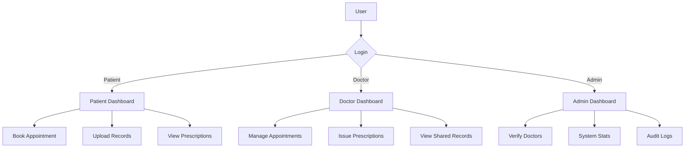
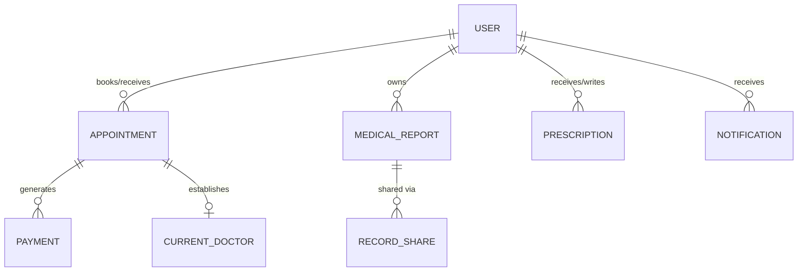

# 🏥 Medicalcare: Professional System Documentation

## 🌟 1. Executive Summary
Medicalcare is a **state-of-the-art** healthcare management platform designed to digitize and optimize the relationship between patients and healthcare providers. The system centralizes appointment scheduling, medical record management, and prescription delivery within a secure, role-based ecosystem.

> [!TIP]
> **Mission:** To provide a seamless, secure, and transparent digital health experience for all stakeholders.

---

## 🏗️ 2. Technical Architecture

### 🛠️ Technology Stack
| Layer | Technology |
| :--- | :--- |
| **Framework** | 🐍 Flask (Python 3.x) |
| **Database** | 🗄️ SQLite with SQLAlchemy ORM |
| **Frontend** | 🎨 Semantic HTML5 & Vanilla CSS3 |
| **Logic** | ⚡ Modern JavaScript ES6+ |
| **Security** | 🔐 PBKDF2 Password Hashing |
| **Payments** | 💳 Razorpay SDK Integration |

### 📊 System Workflow

---

## 👥 3. User Roles & Permissions

### 🧪 Patient Interface
*   **Unified Dashboard:** Real-time overview of health activity.
*   **Smart Booking:** Integrative appointment scheduling with `Online`/`Offline` payment support.
*   **Digital Health Vault:** Encrypted storage for medical reports.

### 🩺 Doctor Interface
*   **Practice Optimization:** Streamlined appointment approval workflow.
*   **e-Prescription:** Fast generation of digital prescriptions with FPDF.
*   **Shared Intelligence:** Access to patient-authorized medical history.

### 🛡️ Administrative Interface
*   **Trust Layer:** Manual verification of medical practitioner credentials.
*   **Operation Monitor:** Live telemetry of system population and activity.
*   **Secure Archives:** Full accessibility to system-wide audit trails.

---

## 📁 4. Data Architecture & Schema

### 🧬 Entity Relationship Model

> [!IMPORTANT]
> **Data Integrity:** Foreign key constraints are enforced across all relational links to ensure a consistent and reliable data state.

---

## 🔒 5. Security & Compliance

> [!CAUTION]
> **Security First:** All sensitive patient data is protected by multiple layers of server-side validation.

### 🛡️ Defense Layers
1.  **Authentication:** Passwords hashed using industry-standard `argon2` or `PBKDF2`.
2.  **Authorization:** Role-based access control (RBAC) enforced at every route.
3.  **Auditing:** Immutable 📜 **AuditTrail** logs every critical action.
4.  **Validation:** Strict file-type filtering for medical report uploads.

---

## 🚀 6. Implementation Workflow

1.  **Deployment:** Container-ready Python environment.
2.  **Lifecycle:** Schema evolution managed via internal migration tools.
3.  **Automation:** Logic-driven notifications for preventive healthcare reminders.

---
*© 2024 MedAppoint Systems. All rights reserved.*
