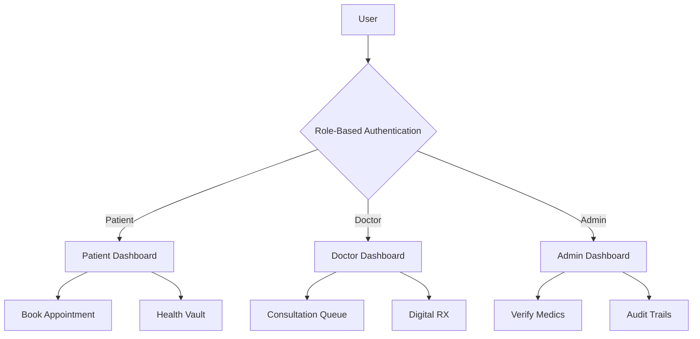

# 🏥 Medicalcare: Advanced Medical Appointment System


**Medicalcare** is a modern, professional-grade healthcare management platform designed to streamline the interaction between patients and doctors. It provides a secure environment for managing appointments, digital prescriptions, and health records.

---

## 🌟 Key Features

### 🧪 For Patients
- **Smart Appointment Booking**: Easy scheduling with specialized doctors.
- **Secure Health Vault**: Upload and manage personal medical reports digitally.
- **E-Prescriptions**: View and download prescriptions issued by doctors.
- **Real-time Notifications**: Automated alerts for appointments and refills.

### 🩺 For Doctors
- **Practice Dashboard**: Efficiently manage patient queues and requests.
- **Consultation Fee Management**: Customize fees for different services.
- **Shared Access**: View medical history share by patients for informed diagnosis.

### 🛡️ For Administrators
- **Verification System**: Approve or reject doctor applications to ensure system quality.
- **Analytics Center**: Track total users, appointments, and system growth.
- **Audit Compliance**: Detailed logs of all critical system activities.

---

## 🏗️ System Architecture



---

## 🚀 How to Run the Project

Follow these steps to get your local environment set up and running:

### 1. Prerequisites
- **Python 3.8+** installed on your system.
- Basic understanding of **Flask** and **Virtual Environments**.

### 2. Setup Environment
Open your terminal and navigate to the project directory:

```bash
# Activate Virtual Environment (Windows)
.\venv\Scripts\activate

# Activate Virtual Environment (Mac/Linux)
source venv/bin/activate
```

### 3. Install Dependencies
```bash
pip install -r requirements.txt
```

### 4. Run the Application
```bash
python app.py
```
The server will start at `http://127.0.0.1:5000/`.

---

## 🛠️ Technology Stack

| Component | Technology |
| :--- | :--- |
| **Backend** | Python Flask |
| **Database** | SQLite (SQLAlchemy) |
| **Frontend** | HTML5, Vanilla CSS, JS |
| **PDF Gen** | FPDF |
| **Payments** | Razorpay Integration |

---

## 🔒 Security Measures
- **Password Hashing**: Secure PBKDF2 hashing for all user credentials.
- **RBAC**: Strict Role-Based Access Control on all routes.
- **Encrypted Uploads**: Guarded storage for sensitive medical files.

---
> [!NOTE]
> This project is designed for educational and developmental purposes. Ensure you update the Razorpay keys in `app.py` for production use.

*© 2024 MedAppoint Systems. Empowering Healthcare Digitally.*
