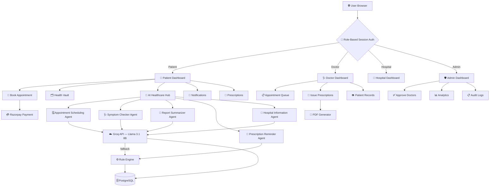

<div align="center">

# 🏥 Medicalcare
### Advanced AI-Powered Medical Appointment System

[](https://openjdk.org/)
[](https://spring.io/projects/spring-boot)
[](https://www.postgresql.org/)
[](https://groq.com/)
[](https://render.com/)
[](LICENSE)

<br/>

> **Medicalcare** is a professional-grade healthcare management platform built with **Java Spring Boot**.
> It seamlessly connects **Patients**, **Doctors**, and **Administrators** — supercharged with an
> **AI Healthcare Hub** powered by **5 specialized AI agents** running on **Groq's Llama 3.1 8B** model.

<br/>

---
</div>

## 📋 Table of Contents

- [🤖 AI Agents — The Core Intelligence](#-ai-agents--the-core-intelligence)
- [✨ Features Overview](#-features-overview)
- [🛠️ Technology Stack](#%EF%B8%8F-technology-stack)
- [🏗️ System Architecture](#%EF%B8%8F-system-architecture)
- [📁 Project Structure](#-project-structure)
- [🚀 Getting Started](#-getting-started)
- [☁️ Deployment — Render](#%EF%B8%8F-deployment--render)
- [🔐 Security](#-security)
- [👥 Default Accounts](#-default-accounts)
- [📸 Application Routes](#-application-routes)

---

## 🤖 AI Agents — The Core Intelligence

> All AI agents are powered by **[Groq API](https://groq.com/)** running the **Meta Llama 3.1 8B Instant** model.
> Each agent has a **dual-layer design**: AI-powered response → automatic fallback to rule-based engine if API is unavailable.

---

### 🗓️ Agent 1 — Appointment Scheduling Agent

| Property | Details |
|----------|---------|
| **Use Case** | Books and manages appointments via natural language |
| **AI Model** | Groq → Llama 3.1 8B Instant |
| **Where Used** | AI Healthcare Hub → "Smart Scheduler" tab |
| **Source File** | `AiAgentService.java` → `parseAndSchedule()` |
| **API Route** | `POST /api/ai/parse-schedule` |

**How It Works:**
1. Patient types a natural language request:
   > *"Book an appointment with Dr. Smith tomorrow at 10:00 AM for fever"*
2. **Groq/Llama** interprets the text and extracts:
   - 🩺 Doctor name → matched against the live database
   - 📅 Date → *"tomorrow"*, *"day after tomorrow"*, or `yyyy-MM-dd` format
   - ⏰ Time → parsed from `HH:MM` pattern
   - 🌅 Shift → Morning / Afternoon / Evening
   - 🤒 Symptoms → extracted after keywords like *"due to"*, *"because of"*
3. Returns a structured booking form pre-filled with extracted data
4. **Fallback:** If Groq is unavailable, regex + keyword rules extract the details

---

### 🩺 Agent 2 — Symptom Checker Agent

| Property | Details |
|----------|---------|
| **Use Case** | Provides preliminary health guidance |
| **AI Model** | Groq → Llama 3.1 8B Instant |
| **Where Used** | AI Healthcare Hub → "Symptom Checker" tab |
| **Source File** | `AiAgentService.java` → `handleAiChat("symptoms")` |
| **API Route** | `POST /api/ai/chat` with `agentType=symptoms` |

**How It Works:**
1. Patient describes symptoms in plain text:
   > *"I have a severe headache and feel dizzy since morning"*
2. **Groq/Llama** is given a detailed system prompt with:
   - All active doctors and their specializations from the live DB
   - Instructions to list 2-3 possible conditions, home care advice, which specialist to see, and red-flag emergency signs
3. Response is returned in clean markdown format
4. **Fallback:** Keyword rule engine maps symptoms to conditions:
   - `fever/chill` → *Viral Fever* → General Medicine
   - `chest/heart/breath` → *Cardiovascular Strain* → Cardiologist
   - `skin/rash/itch` → *Allergic Dermatitis* → Dermatologist
   - `headache/migraine` → *Tension Headache* → Neurologist
   - `stomach/nausea` → *Gastroenteritis* → Gastroenterologist

---

### 📄 Agent 3 — Medical Report Summarizer

| Property | Details |
|----------|---------|
| **Use Case** | Summarizes medical reports in patient-friendly language |
| **AI Model** | Groq → Llama 3.1 8B Instant |
| **Where Used** | Health Vault → AI wand icon next to any uploaded report |
| **Source File** | `AiAgentService.java` → `summarizeReport()` |
| **API Route** | `GET /patient/ai-summarize/{reportId}` |

**How It Works:**
1. Doctor uploads a medical report with a description/notes
2. Patient clicks the **🤖 AI Summarize** button on the report
3. **Groq/Llama** receives the report metadata:
   - Report name, category (Prescription / Test Report / Diagnosis), date, and doctor notes
4. Returns a **patient-friendly markdown summary** with:
   - Key findings in plain language
   - What the patient should watch out for
   - Action recommendations
5. **Fallback:** Structured template builder generates category-specific summaries without AI

---

### 💊 Agent 4 — Prescription Reminder Agent

| Property | Details |
|----------|---------|
| **Use Case** | Sends automated medication reminders |
| **AI Model** | Rule-based (automated scheduler) |
| **Where Used** | Patient Dashboard → 🔔 Notification Bell |
| **Source File** | `NotificationService.java` → `checkAndGenerateNotifications()` |
| **Trigger** | Auto-runs on every patient dashboard load |

**How It Works:**
The agent monitors 3 types of reminders automatically:

```
📅 Type 1 — Appointment Reminders
   → Detects approved appointments scheduled for tomorrow
   → Sends: "Reminder: Upcoming appointment with Dr. X tomorrow at 10:00"

💊 Type 2 — Prescription Refill Reminders
   → Detects prescriptions older than 30 days
   → Sends: "Your prescription from Dr. X may need a refill soon"

⏰ Type 3 — Daily Medication Alarms
   → Patient-configured alarms with medicine name, dosage, time-of-day
   → Sends: "Medication Alarm: Time to take Metformin 500mg (Morning)"
```

---

### 🏥 Agent 5 — Hospital Information Agent

| Property | Details |
|----------|---------|
| **Use Case** | Answers hospital-related queries conversationally |
| **AI Model** | Groq → Llama 3.1 8B Instant |
| **Where Used** | AI Healthcare Hub → "Hospital Info" tab |
| **Source File** | `AiAgentService.java` → `handleAiChat("hospital")` |
| **API Route** | `POST /api/ai/chat` with `agentType=hospital` |

**How It Works:**
1. Visitor/patient asks a hospital question:
   > *"What are the visiting hours?" / "Which hospitals are in your network?"*
2. **Groq/Llama** is given a live system prompt containing:
   - All approved & registered hospitals from the DB (name, address, phone, specialties)
   - All active doctors with their hospital affiliations
3. Returns a conversational, helpful response
4. **Fallback:** Keyword rules cover common queries:
   - `timing/hours/open` → Returns OPD and visitor hours
   - `emergency/icu` → Returns emergency hotline info
   - `location/address` → Returns hospital addresses from DB
   - `insurance/billing` → Returns payment policy info

---

### 🧠 AI Architecture Summary

```
Patient Question / Request
        │
        ▼
┌───────────────────────────────────────────────┐
│           AI Healthcare Hub                    │
│  ┌─────────────────────────────────────────┐  │
│  │  Groq API → Llama 3.1 8B Instant        │  │
│  │  Endpoint: api.groq.com/openai/v1/...   │  │
│  │  Auth: Bearer Token (gsk_...)           │  │
│  └──────────────┬──────────────────────────┘  │
│                 │ success / null               │
│        ┌────────┴────────┐                    │
│        ▼                 ▼                    │
│   AI Response      Rule-Based Fallback        │
│   (Markdown)       (Keyword Engine)           │
└───────────────────────────────────────────────┘
        │
        ▼
  Response to Patient
```

**Key Detection Logic** — The system auto-detects the AI provider from the API key prefix:
```java
// If key starts with "gsk_" → Groq API is used
boolean isGroq = apiKey.startsWith("gsk_");
// → routes to api.groq.com (OpenAI-compatible endpoint)
// → uses Llama 3.1 8B Instant model
// This project uses ONLY Groq — no Google Gemini
```

---

## ✨ Features Overview

<table>
<tr>
<td width="33%">

### 🧪 For Patients
- 📅 Smart appointment booking
- 💊 E-Prescription download (PDF)
- 🗂️ Health Vault — upload & manage reports
- 🤖 AI Healthcare Hub (5 agents)
- 🔔 Real-time notifications
- 👨‍⚕️ My Doctors list
- 🔗 Selective record sharing with doctors

</td>
<td width="33%">

### 🩺 For Doctors
- 📋 Appointment queue management
- 📝 Issue digital prescriptions
- 👁️ View shared patient records
- 📊 Practice dashboard with stats
- 💰 Consultation fee display

</td>
<td width="33%">

### 🛡️ For Admins
- ✅ Doctor verification & approval
- 📊 Live analytics dashboard
- 💵 Consultation fee management
- 📢 Send custom notifications
- 🔍 Full audit trail & logs
- 🏥 Hospital management

</td>
</tr>
</table>

---

## 🛠️ Technology Stack

| Layer | Technology | Purpose |
|-------|-----------|---------|
|  | **Java 17** | Core programming language |
|  | **Spring Boot 3.2.5** | Application framework |
|  | **Spring Data JPA / Hibernate** | ORM & database abstraction |
|  | **Thymeleaf** | Server-side HTML templating |
|  | **H2 Database** | Development database |
|  | **PostgreSQL** | Production database |
|  | **Groq API** | AI inference engine |
|  | **Razorpay** | Online payment gateway |
|  | **OpenPDF** | Prescription PDF generation |
|  | **Apache Maven** | Build & dependency management |
|  | **Docker** | Containerization for deployment |
|  | **Render** | Cloud hosting platform |
|  | **HTML5 / CSS3 / JS** | Frontend (Vanilla) |

---

## 🏗️ System Architecture



---

## 📁 Project Structure

```
medical_appointment_system/
│
├── 📄 Dockerfile                          # Docker build for Render
├── 📄 pom.xml                             # Maven dependencies
├── 📄 README.md                           # This file
│
└── src/main/
    ├── java/com/medicalapp/
    │   │
    │   ├── 🚀 MedicalAppApplication.java  # Spring Boot entry point
    │   │
    │   ├── config/
    │   │   ├── WebMvcConfig.java          # Static resources & interceptors
    │   │   └── AuthInterceptor.java       # Session RBAC enforcement
    │   │
    │   ├── model/                         # JPA Entity classes
    │   │   ├── User.java                  # Patient / Doctor / Admin / Hospital
    │   │   ├── Appointment.java
    │   │   ├── Prescription.java
    │   │   ├── MedicalReport.java
    │   │   ├── Notification.java
    │   │   ├── PrescriptionReminder.java
    │   │   └── AuditLog.java
    │   │
    │   ├── repository/                    # Spring Data JPA interfaces
    │   │
    │   ├── controller/
    │   │   ├── HomeController.java        # Login, Register, Home + Admin init
    │   │   ├── PatientController.java     # Patient portal routes
    │   │   ├── DoctorController.java      # Doctor portal routes
    │   │   ├── HospitalController.java    # Hospital dashboard routes
    │   │   ├── AdminController.java       # Admin panel routes
    │   │   ├── ApiController.java         # REST API endpoints
    │   │   └── AiAgentController.java     # 🤖 AI Agent REST APIs
    │   │
    │   ├── service/
    │   │   ├── AiAgentService.java        # 🤖 All 5 AI agent logic
    │   │   ├── NotificationService.java   # Smart notification triggers
    │   │   └── PdfService.java            # Prescription PDF generator
    │   │
    │   └── util/
    │       └── HashUtils.java             # PBKDF2 password hashing
    │
    └── resources/
        ├── application.properties         # App & DB configuration
        ├── static/
        │   ├── css/style.css              # Premium UI styles
        │   ├── js/script.js               # Frontend logic
        │   └── uploads/                   # Patient uploaded files
        └── templates/                     # Thymeleaf HTML pages
            ├── layout.html
            ├── home.html
            ├── ai_assistant.html          # 🤖 AI Healthcare Hub
            ├── patient_dashboard.html
            ├── doctor_dashboard.html
            ├── admin_dashboard.html
            ├── hospital_dashboard.html
            ├── appointment.html
            ├── medical_reports.html
            ├── prescription.html
            └── audit_logs.html
```

---

## 🚀 Getting Started

### Prerequisites

- ☕ **Java 17+** installed → [Download](https://adoptium.net/)
- 📦 **Apache Maven 3.6+** → [Download](https://maven.apache.org/)
- No database setup needed for development (H2 runs in-memory)

### 1. Clone the Repository

```bash
git clone https://github.com/PRAGATHISH-2006/medical_appointment_system.git
cd medical_appointment_system
```

### 2. Configure Environment (Optional for local dev)

Create a `.env` file or set these in your IDE run config:

```properties
GEMINI_API_KEY=gsk_your_groq_api_key_here
```

> For local dev, H2 database is used automatically — no DB setup needed!

### 3. Run the Application

```bash
mvn spring-boot:run
```

The server starts at **`http://localhost:5000`**

### 4. Access the Application

| URL | Description |
|:----|:------------|
| `http://localhost:5000` | 🏠 Home Page |
| `http://localhost:5000/login` | 🔐 Login |
| `http://localhost:5000/register` | 📝 Register |
| `http://localhost:5000/h2-console` | 🗄️ H2 DB Console *(dev only)* |

**H2 Console Config:**
```
JDBC URL : jdbc:h2:mem:medical_appointment
Username : sa
Password : (leave blank)
```

---

## ☁️ Deployment — Render

This project is deployed on **[Render](https://render.com)** using **Docker**.

### Environment Variables Required on Render

| Variable | Description |
|----------|-------------|
| `SPRING_DATASOURCE_URL` | `jdbc:postgresql://host:5432/dbname` |
| `SPRING_DATASOURCE_USERNAME` | PostgreSQL username |
| `SPRING_DATASOURCE_PASSWORD` | PostgreSQL password |
| `SPRING_DATASOURCE_DRIVER` | `org.postgresql.Driver` |
| `JPA_DIALECT` | `org.hibernate.dialect.PostgreSQLDialect` |
| `H2_CONSOLE_ENABLED` | `false` |
| `GEMINI_API_KEY` | Your Groq API key (`gsk_...`) |
| `APP_SECRET_KEY` | A strong random secret string |
| `APP_RAZORPAY_KEY_ID` | Razorpay Key ID |
| `APP_RAZORPAY_KEY_SECRET` | Razorpay Secret |
| `PORT` | Auto-injected by Render |

> The Dockerfile uses a **multi-stage build** — Maven builds the JAR in stage 1,
> and a lean JRE image runs it in stage 2. Port is dynamically bound via `$PORT`.

---

## 🔐 Security

| Feature | Implementation |
|---------|---------------|
| **Password Hashing** | PBKDF2 with SHA-256 (via `HashUtils.java`) |
| **Access Control** | Role-Based (patient / doctor / hospital / admin) enforced by `AuthInterceptor` on every request |
| **File Uploads** | UUID-prefixed filenames, size limited to 10MB |
| **Secrets** | All API keys stored as environment variables — never hardcoded |
| **H2 Console** | Disabled in production via `H2_CONSOLE_ENABLED=false` |
| **Audit Trail** | All sensitive actions logged with timestamp, user, and action type |

---

## 👥 Default Accounts

> ⚠️ **Change these immediately after first deployment!**

| Role | Email | Password |
|------|-------|----------|
| **Admin** | `admin@system.com` | `admin123` |

The admin account is **auto-created on first startup** if it doesn't exist in the database.

---

## 📸 Application Routes

| Route | Role | Description |
|-------|------|-------------|
| `/` | Public | Home / Landing page |
| `/login` | Public | Login page |
| `/register` | Public | Registration page |
| `/patient/dashboard` | Patient | Patient home dashboard |
| `/patient/ai-assistant` | Patient | 🤖 AI Healthcare Hub |
| `/patient/appointments` | Patient | Book & view appointments |
| `/patient/medical-reports` | Patient | Health Vault |
| `/patient/prescriptions` | Patient | View prescriptions |
| `/patient/notifications` | Patient | Notification center |
| `/doctor/dashboard` | Doctor | Doctor home dashboard |
| `/doctor/prescriptions` | Doctor | Issue prescriptions |
| `/hospital/dashboard` | Hospital | Hospital management |
| `/admin/dashboard` | Admin | Admin control panel |
| `/admin/audit-logs` | Admin | Audit trail |
| `/api/ai/gemini-chat` | Patient (API) | 🤖 AI chat endpoint |
| `/api/ai/parse-schedule` | Patient (API) | 🤖 AI scheduler endpoint |

---

<div align="center">

## 🌟 Key Highlights

```
🤖 5 AI Agents    ☁️ Groq Llama 3.1    🐳 Dockerized    🚀 Deployed on Render
💊 E-Prescriptions    💳 Razorpay    🔐 PBKDF2 Security    📊 Audit Logs
```

---

*Built with ❤️ by [PRAGATHISH-2006](https://github.com/PRAGATHISH-2006)*

*© 2026 Medicalcare Systems — Empowering Healthcare Digitally*

</div>
