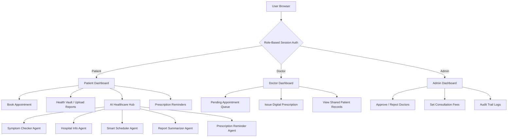

# 🏥 Medicalcare: Advanced Medical Appointment System


**Medicalcare** is a modern, professional-grade healthcare management platform built with **Java Spring Boot**. It streamlines interaction between patients, doctors, and administrators — with an integrated **AI Healthcare Hub** powered by 5 specialized intelligent agents.

---

## 🌟 Key Features

### 🤖 AI Healthcare Hub (New)
- **Symptom Checker Agent**: Analyzes patient-described symptoms using NLP keyword matching, offers preliminary health guidance, and recommends matching specialist doctors from the system.
- **Hospital Information Agent**: Conversational chatbot for visitor Q&A — answers queries about timings, emergency contacts, billing policies, insurance, and hospital address.
- **Smart Appointment Scheduler Agent**: Parses natural language scheduling requests (e.g. *"Book with Dr. Jane tomorrow at 10 AM"*), extracts date/time/doctor, and provides a one-click booking confirmation.
- **Medical Report Summarizer Agent**: Click the AI wand icon next to any uploaded medical record to generate a structured summary with findings and warning indicators.
- **Prescription Reminder Agent**: Patients can set and manage daily medication alarm logs with medicine names, dosages, and custom time-of-day triggers.

### 🧪 For Patients
- **Smart Appointment Booking**: Easy scheduling with specialized doctors with online (Razorpay) or offline payment options.
- **Secure Health Vault**: Upload and manage personal medical reports (PDFs) digitally with AI report analysis.
- **E-Prescriptions**: View and download prescriptions issued by doctors as formatted PDF files.
- **Record Sharing**: Selectively share specific medical records with trusted doctors.
- **Real-time Notifications**: Automated alerts for upcoming appointments, prescription refills, and general checkup reminders.
- **My Doctors**: View assigned doctors, see their recent prescriptions, and book follow-up appointments.

### 🩺 For Doctors
- **Practice Dashboard**: Efficiently manage patient appointment queues — approve or reject pending requests.
- **Digital Prescriptions**: Issue prescriptions with medicines, dosage schedules, and instructions. Auto-generated PDF delivery.
- **Patient Records Access**: View medical history shared by patients for more informed diagnosis.
- **Consultation Fee Management**: Fees set by admin per doctor profile.

### 🛡️ For Administrators
- **Verification System**: Approve or reject doctor registration applications.
- **Analytics Center**: Live stats on total patients, approved doctors, pending approvals, and appointment counts.
- **Doctor Management**: Update doctor consultation fees and manage access.
- **Patient Notifications**: Send custom notifications directly to individual patients.
- **Audit Compliance**: Detailed activity logs of all critical system operations (uploads, shares, deletions, credential changes).

---

## 🏗️ System Architecture



---

## 🛠️ Technology Stack

| Component | Technology |
| :--- | :--- |
| **Backend** | Java 17+ / Spring Boot 3.2.5 |
| **MVC / Web** | Spring MVC + Thymeleaf Templating Engine |
| **Database (Dev)** | H2 In-Memory Database |
| **Database (Prod)** | PostgreSQL (configurable via `application.properties`) |
| **ORM** | Spring Data JPA / Hibernate |
| **Frontend** | HTML5, Vanilla CSS, Vanilla JavaScript |
| **PDF Generation** | OpenPDF (LibrePDF) |
| **Payments** | Razorpay Integration |
| **Security** | PBKDF2 Password Hashing + Session-based RBAC |
| **Build Tool** | Apache Maven |

---

## 🚀 How to Run the Project

### Prerequisites
- **Java 17+** installed
- **Apache Maven 3.6+** (or use IntelliJ IDEA's bundled Maven)
- No database setup required for development — H2 runs in-memory automatically

### 1. Clone the Repository
```bash
git clone <your-repo-url>
cd medical_appointment_system
```

### 2. Build the Project
```bash
mvn clean package -DskipTests
```

Or using IntelliJ's bundled Maven on Windows:
```powershell
& "C:\Program Files\JetBrains\IntelliJ IDEA 2025.2.4\plugins\maven\lib\maven3\bin\mvn.cmd" clean package -DskipTests
```

### 3. Run the Application
```bash
mvn spring-boot:run
```

The server starts at **`http://localhost:5000`**

### 4. Access the Application
| URL | Description |
|:----|:------------|
| `http://localhost:5000` | Home Page |
| `http://localhost:5000/login` | Login Page |
| `http://localhost:5000/register` | Register Page |
| `http://localhost:5000/h2-console` | H2 Database Console (dev only) |

**H2 Console Settings (Dev):**
- JDBC URL: `jdbc:h2:mem:medical_appointment`
- Username: `sa`
- Password: *(empty)*

---

## 👥 Default Admin Account

On first startup, the system auto-creates an admin account:

| Field | Value |
|:------|:------|
| Email | `admin@system.com` |
| Password | `admin123` |

---

## 📁 Project Structure

```
src/
└── main/
    ├── java/com/medicalapp/
    │   ├── MedicalAppApplication.java      # Application entry point
    │   ├── config/
    │   │   ├── WebMvcConfig.java           # Static resources, interceptors
    │   │   └── AuthInterceptor.java        # Session auth + navbar variable injection
    │   ├── model/                          # JPA Entity classes
    │   │   ├── User.java
    │   │   ├── Appointment.java
    │   │   ├── Prescription.java
    │   │   ├── MedicalReport.java
    │   │   ├── Notification.java
    │   │   ├── PrescriptionReminder.java
    │   │   └── ... (more)
    │   ├── repository/                     # Spring Data JPA interfaces
    │   ├── controller/
    │   │   ├── HomeController.java         # Login, Register, Home
    │   │   ├── PatientController.java      # Patient portal
    │   │   ├── DoctorController.java       # Doctor portal
    │   │   ├── AdminController.java        # Admin panel
    │   │   ├── ApiController.java          # REST endpoints
    │   │   └── AiAgentController.java      # AI Agent REST APIs
    │   ├── service/
    │   │   ├── AiAgentService.java         # NLP parsing & AI agent logic
    │   │   ├── PdfService.java             # Prescription PDF generator
    │   │   └── NotificationService.java    # Smart notification triggers
    │   └── util/
    │       └── HashUtils.java              # PBKDF2 password hashing
    └── resources/
        ├── application.properties          # App configuration
        ├── static/
        │   ├── css/style.css               # Premium UI stylesheet
        │   ├── js/script.js                # Frontend scripts
        │   └── uploads/                    # Patient-uploaded documents
        └── templates/                      # Thymeleaf HTML templates
            ├── layout.html
            ├── home.html
            ├── patient_dashboard.html
            ├── doctor_dashboard.html
            ├── admin_dashboard.html
            ├── ai_assistant.html           # AI Healthcare Hub
            ├── appointment.html
            ├── medical_reports.html
            ├── prescription.html
            ├── audit_logs.html
            └── ... (more)
```

---

## 🔒 Security Measures
- **Password Hashing**: Secure PBKDF2 with SHA-256 hashing for all user credentials.
- **RBAC**: Strict Role-Based Access Control enforced via HTTP session interceptors on all routes.
- **Upload Validation**: Medical file uploads stored with UUID-prefixed filenames to prevent collisions.
- **Audit Logging**: All sensitive actions (uploads, shares, deletions) are recorded in the audit trail.

---

## 🌐 Production Database (PostgreSQL)

To switch from H2 to PostgreSQL, update `src/main/resources/application.properties`:

```properties
spring.datasource.url=jdbc:postgresql://localhost:5432/medical_appointment
spring.datasource.driverClassName=org.postgresql.Driver
spring.datasource.username=your_db_user
spring.datasource.password=your_db_password
spring.jpa.database-platform=org.hibernate.dialect.PostgreSQLDialect
spring.h2.console.enabled=false
```

---

> [!NOTE]
> This project is designed for educational and developmental purposes. Update the Razorpay API keys in `application.properties` before deploying to production.

> [!TIP]
> The H2 in-memory database resets on every server restart. For persistent development data, switch to a file-based H2 URL: `jdbc:h2:file:./data/medical_appointment`

*© 2026 MedAppoint Systems. Empowering Healthcare Digitally.*
